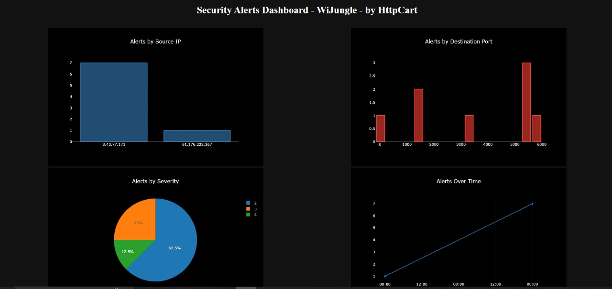

# Security Dashboard - WiJungle - by httpCart

## Overview
This project is a security dashboard developed by Alok Kumar for WiJungle as part of an internship assignment. The dashboard visualizes security alerts data using various graphs and charts, providing insights into different aspects of the data.

## Features
- **Dark Theme:** The dashboard uses a dark theme for better visibility and aesthetics.
- **Responsive Design:** The graphs and charts are designed to be responsive, ensuring a consistent user experience across different devices and screen sizes.
- **Multiple Graphs:** The dashboard includes four graphs, each offering unique insights into the security alerts data.
- **Beautiful Visualizations:** The graphs are visually appealing, making it easier for users to interpret the data.
- **Data Fetching:** The dashboard fetches data from a JSON file (`data.json`) to dynamically populate the graphs.

## Graphs Included
1. **Alerts by Source IP:** Displays the distribution of security alerts based on the source IP addresses.
2. **Alerts by Destination Port:** Shows the distribution of security alerts based on the destination ports.
3. **Alerts by Severity:** Visualizes the distribution of security alerts based on their severity levels using a pie chart.
4. **Alerts Over Time:** Displays the trend of security alerts over time, showing how the number of alerts has varied over different dates.

## Technologies Used
- **React:** The project is built using React, a popular JavaScript library for building user interfaces.
- **Plotly.js:** Used for creating interactive and beautiful graphs and charts.
- **Axios:** Utilized for making HTTP requests to fetch data from the server.
- **Vercel:** The project is deployed using Vercel.

## Usage
To run the project locally:
1. Clone the repository: `git clone https://github.com/alk-alok/httpcart-assignment.git`
2. Navigate to the project directory: `cd httpcart-assignment`
3. Install dependencies: `npm install`
4. Start the development server: `npm start`
5. Open your browser and visit `http://localhost:3000` to view the dashboard.

## Screenshots

## Author
- **Name:** Alok Kumar
- **Resume:** [Click here for Resume](https://drive.google.com/file/d/1qDRgRgMlzDMCfO8zL4gq389nV8U_Xhrg/view)

---

Feel free to modify the content as needed and add any additional sections or details that you think would be relevant!
